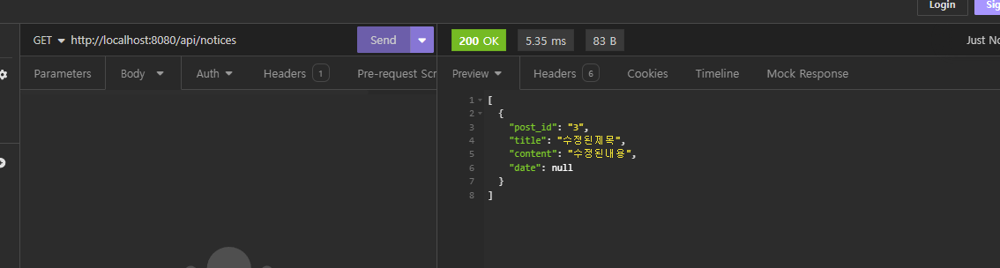

# WhereIsMyHome_6_Spring_11_HwarangOh_ChanminLee

## Description

- WhereIsMyHome_6_Spring_11 is a project aimed at creating a REST API for the next sprint.
- This sprint will focus on integrating the Spring Framework to develop the backend of the website.
- The database will serve as a vital component in our project's development, providing a structured and efficient way to store and manage data.

## MAIN API
### Notice CRUD

- Create Notice
  
  _Creating Notice_

- Retrieve Notice
  
   _Retrieving One Notice_
  
  _Retrieving All Notice_

- Update Notice
  
  
  _Updating One Notice_

- Delete Notice
  
  
  _Deleting One Notice_

## 기능 및 요구사항

### 필수 기능

---

### 주택 실거래가 정보

- 지도, 검색, 좋아요, 조회수 기능 추가
- KMP 알고리즘을 이용해서 주택 정보 지도 검색 기능 개발
- 사용자가 선호하는 주택 정보에 대해 "좋아요" 기능

### 주변 환경 정보

- 알고리즘을 도입하여 주변 환경 점수 계산 기능 개발
- 우선순위 큐(Priority Queue)를 이용한 주변 환경 정보 점수 정렬 기능 제공

### 관심 지역 정보

- 사용자가 관심 있는 지역 정보 관리 기능 추가
- 사용자가 관심 있는 지역을 별표로 표시하여 관리할 수 있는 기능 제공

### 회원 정보

- 로그인 기능을 통해 세션 유지 및 사용자 정보 관리 기능 제공

### 추가 기능

---

### 뉴스 게시판

- Naver 부동산 API를 통한 뉴스 게시판 기능 추가
- 부동산 관련 뉴스를 제공하여 사용자에게 정보를 제공하는 기능 개발

### 공지사항 게시판

- 공지사항을 CRUD(Create, Read, Update, Delete)할 수 있는 기능 제공
- 관리자가 공지사항을 작성, 수정, 삭제할 수 있는 기능 추가

### 동네 게시판

- 사용자별로 게시판을 생성하여 자유롭게 글을 작성, 수정, 삭제할 수 있는 기능 제공
- 각 게시판은 사용자가 살았던 지역을 기반으로 생성되며, CRUD 기능을 제공함
- 회원이 살고 있는 곳 또는 살았던 곳 정보를 관리하고, 해당 정보로 동네 게시판 권한 제공

**심화 기능: ChatBot**

- 직접 답변하는 챗봇 기능 추가
- 사용자의 질문에 대해 유사도 분석을 통해 FAQ 기반 적합한 답변을 제공하는 기능 개발

## DB Visuals

_Visual representation of the database schema_

## Getting Started

To get started with the project, follow the steps below:

1. Clone this repository to your local machine.
2. Ensure that you have installed STS tools and Tomcat Server for development.
3. Open [HappyHome] in STS tools to begin development.

## Installation

Ensure you have the necessary tools and dependencies installed as mentioned in the Getting Started section.

## Usage

Once set up, you can start developing the backend of the website using the Spring Framework and interacting with the database as needed.

## Support

For any assistance or inquiries, feel free to reach out to the project maintainers:

- GitHub: [Hwarang-Oh](https://github.com/Hwarang-Oh)
- Instagram: [99ohwarang](https://www.instagram.com/99ohwarang/)

## Roadmap

- Integrate Spring Framework for backend development.
- Implement CRUD operations for interacting with the database.
- Enhance database functionality based on project requirements and user feedback.

## Contributing

Contributions to the project are welcome. Please refer to the contribution guidelines for more details.

## Authors and Acknowledgment

This project is maintained by HwarangOh and ChanminLee. We would like to acknowledge all contributors for their valuable input and efforts in developing this project.

## License

This project does not require any licenses.

## Project Status

Development of the database and backend functionality is ongoing and actively maintained.
